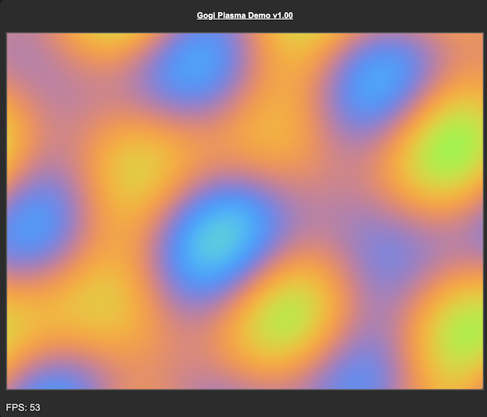

# GOGI

Go Graphics Interface - Lame name, I know, I know.

I wanted to do a plasma demo in the browser with Go. This is how I ended up with this. It looks like I built a mini-graphics library in the end because that's what I did. The code is there, I'll document it more/better/further as I get time.

I'm using TinyGo and you can check the task file to see the commands used to create the wasm binary.

The pixel buffer and the rest of it is useful for other graphics effects as well, give it a whirl!

## The Goal

I'm going to turn this into a package, promise. It sort of is already, I just haven't bothered releasing it yet, I want to clean up one or two things.

## The Code

The `demo` directory contains, to your big surprise, the demo!  Then there's a bunch of directories like `buffers`, `canvas`, `colour`, `lookups` etc. that contain the graphics utilities.  It's probably easier to start with `demo` and look from there, but don't let me tell you what to do!

## Task
Gogi uses [Task](https://taskfile.dev/) to make life easier.
